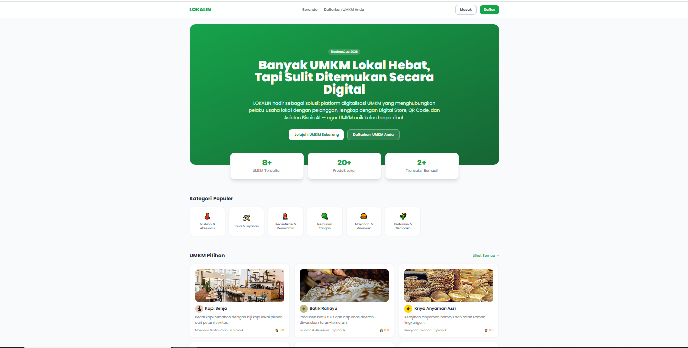
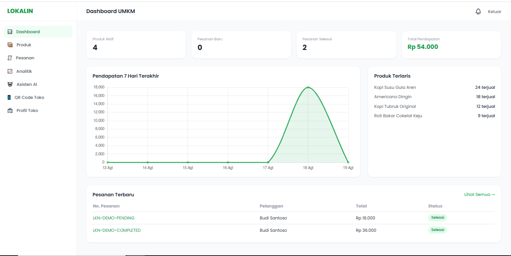
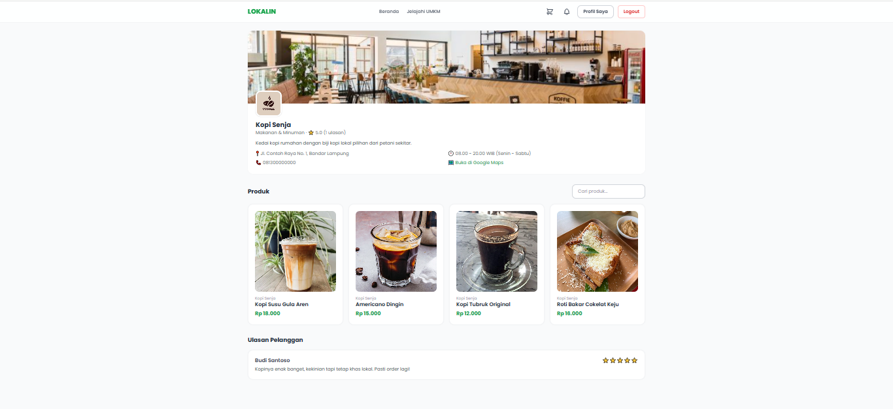
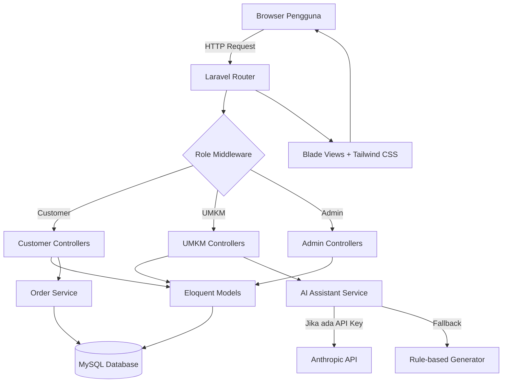

<div align="center">

  # LOKALIN

  ### Smart Digital Ecosystem for Local UMKM — Naik Kelas Digital Tanpa Ribet

  [](https://github.com/anwar-iman21/lokalin)
  [](LICENSE)
  [](https://laravel.com)

  **Submission for ITECHNO CUP 2026 - Web Development**
  **Fokus SDG 8: Pekerjaan Layak dan Pertumbuhan Ekonomi**

  **By WEBDEV NAKAMA**

</div>

---

## 📋 Daftar Isi
- [Tentang Proyek](#-tentang-proyek)
- [Fitur Unggulan](#-fitur-unggulan)
- [Demo & Screenshot](#-demo--screenshot)
- [Teknologi](#️-teknologi)
- [Arsitektur Sistem](#️-arsitektur-sistem)
- [Instalasi & Setup](#️-instalasi--setup)
- [Penggunaan](#-penggunaan)
- [Struktur Routing](#-struktur-routing)
- [Testing](#-testing)
- [Tim Pengembang](#-tim-pengembang)
- [Lisensi](#-lisensi)

---

## 👥 Tim Pengembang

| Nama | GitHub |
|------|--------|
| **AHMAD ANWARUL IMAN ALFAQIH** | [@anwar-iman21](https://github.com/anwar-iman21) |
| **RAZZI RONALDI** | [@RazziRonaldi23](https://github.com/RazziRonaldi23) |
| **YANDRI UTAMA** | [@iyan22-afk](https://github.com/iyan22-afk) |

---

## 🎯 Tentang Proyek

### Latar Belakang

Indonesia memiliki lebih dari 65 juta pelaku UMKM yang menjadi tulang punggung perekonomian nasional, namun sebagian besar masih menjalankan usahanya secara konvensional/offline. Minimnya literasi digital, biaya pembuatan platform online yang mahal, dan sulitnya bersaing dengan marketplace besar membuat banyak UMKM lokal sulit ditemukan oleh calon pelanggan di sekitarnya — padahal produk yang mereka tawarkan tidak kalah berkualitas.

### Solusi yang Ditawarkan

**LOKALIN** hadir sebagai platform digitalisasi khusus UMKM lokal yang menggabungkan tiga hal dalam satu ekosistem: **Digital Store** siap pakai (tanpa perlu coding), **QR Code toko** yang bisa langsung dicetak dan ditempel di lokasi usaha fisik, serta **Asisten Bisnis bertenaga AI** yang membantu UMKM membuat caption promosi, deskripsi produk, dan strategi pemasaran secara otomatis — sehingga UMKM bisa naik kelas secara digital tanpa perlu tim IT atau budget besar.

### Tujuan Proyek

- 🎯 **Tujuan Utama**: Menjembatani UMKM lokal dan pelanggan melalui platform digital yang mudah digunakan, mendukung transaksi *delivery* maupun *pickup*.
- 📊 **Target Pengguna**: Pelaku UMKM (kuliner, fashion, kerajinan, kecantikan, jasa, dan pertanian) serta masyarakat umum yang ingin berbelanja produk lokal.
- 💡 **Value Proposition**: Satu platform terintegrasi — toko online, pemesanan, manajemen pesanan, analitik bisnis, QR Code, dan asisten AI — tanpa biaya berlangganan dan tanpa ketergantungan API berbayar (fitur AI tetap berfungsi penuh lewat mode fallback bila tanpa API key).

---

## ✨ Fitur Unggulan

### Fitur Utama

| Fitur | Deskripsi | Keunggulan |
|----------|--------------|---------------|
| **Digital Store per UMKM** | Setiap UMKM otomatis mendapat halaman toko online (`/store/nama-toko`) lengkap dengan katalog produk, rating, dan info lokasi. | Tidak perlu coding atau biaya pembuatan website terpisah. |
| **QR Code Toko Otomatis** | QR Code dibuat otomatis dari link toko, siap diunduh dan dicetak untuk ditempel di lokasi usaha fisik. | Menjembatani dunia offline dan online tanpa alat tambahan. |
| **Asisten Bisnis AI** | Membantu UMKM membuat caption promosi, deskripsi produk, ide konten, dan strategi promosi secara otomatis. | Tetap berfungsi penuh (mode *rule-based fallback*) meski tanpa API key AI berbayar — selalu bisa didemokan. |
| **Manajemen Pesanan Real-time** | Alur status pesanan lengkap (menunggu → dikonfirmasi → diproses → siap → diantar/diambil → selesai) untuk metode *delivery* maupun *pickup*. | Transparan bagi pelanggan dan mudah dikelola oleh UMKM. |

### Fitur Tambahan

- **Multi-role system** — 3 peran berbeda (Pelanggan, UMKM, Admin) dengan hak akses dan dashboard masing-masing.
- **Verifikasi UMKM oleh Admin** — UMKM baru wajib disetujui admin sebelum tampil publik, menjaga kualitas platform.
- **Lokasi GPS & Google Maps** — pelanggan dapat memakai lokasi GPS saat checkout, dan tombol "Buka Rute" langsung ke Google Maps.
- **Dashboard Analitik** — grafik pendapatan, produk terlaris, dan distribusi status pesanan untuk UMKM maupun admin.
- **Sistem Rating & Ulasan** — pelanggan dapat memberi ulasan setelah pesanan selesai, otomatis memengaruhi rating toko.
- **Notifikasi In-App** — UMKM dan pelanggan mendapat notifikasi untuk kejadian penting (persetujuan toko, dll).

---

## 📸 Demo & Screenshot

### Live Demo

🔗 **[ISI LINK DEMO DI SINI]** — *(Jika belum di-hosting permanen, tuliskan: "Demo dijalankan secara live saat presentasi karena keterbatasan hosting gratis untuk Laravel + MySQL")*

### Akun Demo untuk Juri

| Role | Email | Password |
|---|---|---|
| Admin | `admin@lokalin.test` | `password` |
| Pelanggan | `customer@lokalin.test` | `password` |
| UMKM | `umkm1@lokalin.test` s/d `umkm5@lokalin.test` | `password` |

### Screenshot Aplikasi

<div align="center">
  
  <p><em>Beranda — Landing page dengan storytelling masalah, solusi, dan dampak</em></p>

  
  <p><em>Dashboard UMKM — Statistik penjualan, grafik pendapatan, dan Asisten AI</em></p>

  
  <p><em>Digital Store — Halaman toko UMKM dengan QR Code dan katalog produk</em></p>
</div>

---

## 🛠️ Teknologi

### Tech Stack

#### Frontend
```
Templating   : Laravel Blade
UI Framework : Tailwind CSS 3
Interaktivity: Alpine.js
Icon         : Lucide (embedded sebagai inline SVG, bukan CDN)
Chart        : Chart.js (bundled via npm/Vite)
Build Tool   : Vite
```

#### Backend
```
Bahasa       : PHP 8.1+
Framework    : Laravel 10
Database     : MySQL
ORM          : Eloquent ORM
Auth         : Laravel Session-based Authentication (built-in)
Validasi     : Laravel Form Request
```

#### DevOps & Tools
```
Version Control : Git & GitHub
Package Manager  : Composer (PHP) & npm (JS)
QR Code Engine   : QR Server API (generate on-the-fly, tanpa simpan file)
AI Integration   : Anthropic API (opsional, dengan rule-based fallback generator)
```

### Alasan Pemilihan Teknologi

| Teknologi | Alasan Pemilihan |
|-----------|------------------|
| **Laravel 10** | Framework PHP matang dengan ekosistem lengkap (Eloquent ORM, migration, validation, middleware) yang mempercepat pengembangan aplikasi marketplace berskala menengah secara aman dan terstruktur. |
| **Blade + Tailwind CSS** | Menghasilkan tampilan modern dan konsisten tanpa overhead build tool JavaScript yang berat, cocok untuk aplikasi *server-rendered* yang butuh SEO baik dan loading cepat. |
| **Alpine.js** | Memberikan interaktivitas ringan (tab, dropdown, form dinamis) tanpa perlu framework JS besar seperti React/Vue, menjaga aplikasi tetap ringan. |
| **Icon & Chart di-bundle lokal (bukan CDN)** | Menghindari kegagalan tampilan akibat pemblokiran CDN oleh jaringan/firewall tertentu — pelajaran dari proses pengembangan agar demo selalu stabil di jaringan manapun. |

---

## 🏗️ Arsitektur Sistem

### System Architecture



### Database Schema (Ringkas)

```
users (customer/umkm/admin)
  └── umkm_profiles (1:1 untuk role umkm)
         └── products (1:N)
                └── product_images (1:N)
  └── carts (1:1) → cart_items (1:N)
  └── orders (1:N) → order_items (1:N)
  └── reviews (1:N)
  └── notifications (1:N)
umkm_profiles → ai_generations (1:N, riwayat Asisten AI)
categories → umkm_profiles, products
```

### Folder Structure

```
lokalin/
├── app/
│   ├── Http/
│   │   ├── Controllers/     # Auth, Customer, Umkm, Admin, Store
│   │   ├── Middleware/      # EnsureRole, EnsureUmkmApproved
│   │   └── Requests/        # Form Request validation per modul
│   ├── Models/               # User, UmkmProfile, Product, Order, dst.
│   └── Services/              # OrderService, AiAssistantService
├── database/
│   ├── migrations/            # Skema seluruh tabel
│   └── seeders/                 # Data demo (akun, kategori, produk)
├── resources/
│   ├── views/
│   │   ├── components/          # Layout & komponen Blade reusable
│   │   ├── landing/ auth/ customer/ umkm/ admin/ store/
│   ├── css/                     # Tailwind entry point
│   └── js/                      # Alpine.js & Chart.js
├── routes/web.php               # Seluruh routing aplikasi
└── lokalin.sql                  # Database dump siap import
```

---

## ⚙️ Instalasi & Setup

### Prerequisites

Pastikan Anda telah menginstall:
- **PHP** (v8.1 atau lebih tinggi)
- **Composer**
- **Node.js** (v18.x atau lebih tinggi) & npm
- **MySQL**
- **Git**

### Langkah Instalasi

#### 1️⃣ Clone Repository
```bash
git clone https://github.com/anwar-iman21/lokalin.git
cd lokalin
```

#### 2️⃣ Install Dependencies
```bash
composer install
npm install
```

#### 3️⃣ Setup Environment Variables
```bash
cp .env.example .env
php artisan key:generate
```

Sesuaikan koneksi database di `.env` (default `DB_DATABASE=lokalin`):
```env
DB_CONNECTION=mysql
DB_HOST=127.0.0.1
DB_PORT=3306
DB_DATABASE=lokalin
DB_USERNAME=root
DB_PASSWORD=

# Opsional — fitur AI Assistant tetap berjalan (mode fallback) tanpa ini
ANTHROPIC_API_KEY=
```

#### 4️⃣ Setup Database

**Opsi A — Import langsung (tercepat, direkomendasikan):**
```bash
# Buat database kosong bernama "lokalin", lalu import:
mysql -u root -p lokalin < lokalin.sql
```

**Opsi B — Migration & seeder standar Laravel:**
```bash
php artisan migrate --seed
```

#### 5️⃣ Build Asset & Jalankan
```bash
php artisan storage:link
npm run build
php artisan serve
```

Aplikasi akan berjalan di `http://localhost:8000`

---

## 🚀 Penggunaan

### Menjalankan Aplikasi
```bash
# Development
php artisan serve
npm run dev        # di terminal terpisah, untuk hot-reload asset

# Production build
npm run build

# Testing
php artisan test
```

### User Guide

#### Untuk Pelanggan
1. **Registrasi/Login**: Daftar sebagai "Pelanggan" di halaman `/register`.
2. **Jelajahi UMKM**: Cari toko berdasarkan kategori atau nama di menu "Jelajahi UMKM".
3. **Belanja & Checkout**: Tambah produk ke keranjang, pilih metode *delivery* (dengan lokasi GPS) atau *pickup*, lalu selesaikan pesanan.
4. **Lacak Pesanan**: Pantau status pesanan secara real-time di menu "Pesanan Saya", beri ulasan setelah pesanan selesai.

#### Untuk UMKM
1. **Registrasi**: Daftar sebagai "Pemilik UMKM", lengkapi profil toko, dan tunggu persetujuan admin.
2. **Kelola Produk**: Tambah, edit, atau nonaktifkan produk melalui menu "Produk".
3. **Kelola Pesanan**: Proses pesanan masuk sesuai alur status, dari "Menunggu" hingga "Selesai".
4. **Asisten AI**: Gunakan menu "Asisten AI" untuk membuat caption promosi dan strategi pemasaran otomatis.
5. **QR Code Toko**: Unduh dan cetak QR Code dari menu "QR Code Toko" untuk ditempel di lokasi usaha.

#### Untuk Admin
1. **Login**: Gunakan akun dengan role admin.
2. **Verifikasi UMKM**: Setujui atau tolak pendaftaran UMKM baru di menu "Kelola UMKM".
3. **Moderasi**: Kelola kategori, produk, pesanan, dan ulasan dari seluruh platform melalui dashboard admin.

---

## 🗺️ Struktur Routing

LOKALIN merupakan aplikasi **server-rendered monolithic** (Laravel MVC tradisional), sehingga tidak mengekspos REST API terpisah untuk konsumsi eksternal — seluruh interaksi dilayani langsung melalui route web standar Laravel. Ringkasan pengelompokan route:

```
Publik          : /, /store/{slug}, /store/{slug}/produk/{slug}, /login, /register
Pelanggan       : /akun/jelajah, /akun/keranjang, /akun/checkout, /akun/pesanan
UMKM Dashboard  : /umkm/dashboard, /umkm/produk, /umkm/pesanan, /umkm/asisten-ai, /umkm/qr-code
Admin Dashboard : /admin/dashboard, /admin/umkm, /admin/pelanggan, /admin/kategori, /admin/pesanan
```

Daftar lengkap dapat dilihat di `routes/web.php`, atau jalankan:
```bash
php artisan route:list
```

---

## 🧪 Testing

### Running Tests
```bash
php artisan test
```

### Cakupan Pengujian
Pengujian mencakup fitur inti seperti akses halaman publik, autentikasi, dan alur transaksi utama. Detail dapat dilihat pada folder `tests/Feature`.

---

## 📄 Lisensi

Proyek ini dibuat untuk keperluan kompetisi **iTechnoCup 2026** dan dilisensikan di bawah [MIT License](LICENSE).

---

<div align="center">

  **Made with ❤️ by WEBDEV NAKAMA for ITECHNO CUP 2026**

</div>
